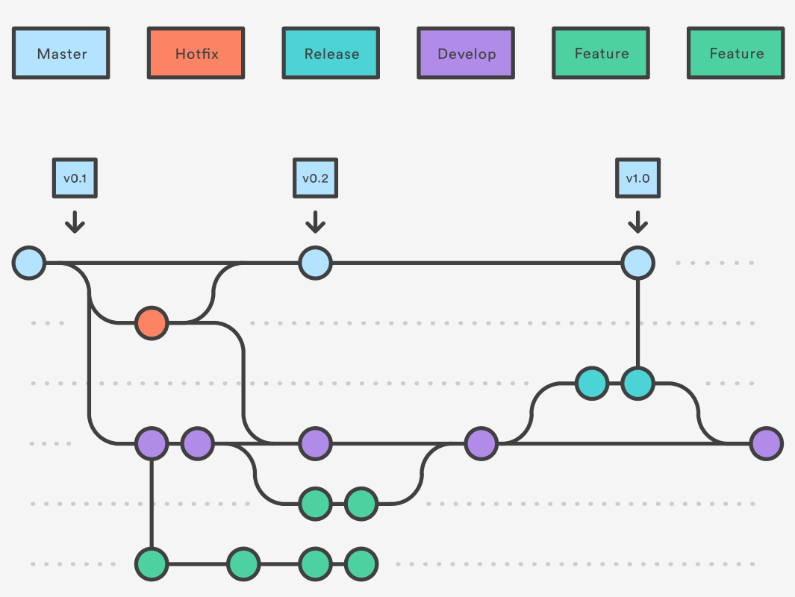

# Github Best Practices

This repository is destinate to create a baseline on how github projects must have and a way to improve customer experience to interact with Open-Source projects.

# [Github Workflow and Branches](https://www.atlassian.com/git/tutorials/comparing-workflows/gitflow-workflow)

# Feature List

- [x] **README Template**
- [x] **Code Of Conduct Template**
- [x] **License Template and Guidelines: Probably there will be a requirement for each one to have they own Open Source license instead of the defaults…**
- [x] **Issue Template**
- [x] **Pull Request Template**
- [x] **Contributing Guidelines**
- [x] **Descriptions and topics**
- [x] **Roadmap**
- [ ] **CI/CD Badges**
- [ ] **Define a versioning logic template (v1.0.0 / 2.0 / v1)**
- [x] **Issue Tracker**
- [x] **Add Code Quality Check** 
- [x] **Add Depedency Check**
- [x] **Add Container Scan**
- [x] **Always Submit Packages on Github and Packages Specific Site (npm, nuget...)**
- [x] **Github Pages Template**
- [x] **Github Wiki Template**
- [x] **Configure Active Monitoring for Bugs and PR's (Slack)**
- [x] **Automate your releases using Actions**
- [x] **Add Container Scan**
- [x] **Publish the Actions thet you Built so Everyone can Reuse the Code**
- [x] **Organization Level Projects (Update All Repos Using Python 2 to Python 3...)**

## Contributing

If you encounter a bug, think of a useful feature, or find something confusing
in the docs, please
[create a new issue](https://github.com/felipecosta09/github-bpg/issues/new)!

We :heart: pull requests. If you'd like to fix a bug, contribute to a feature or
just correct a typo, please feel free to do so.

If you're thinking of adding a new feature, consider opening an issue first to
discuss it to ensure it aligns to the direction of the project (and potentially
save yourself some time!).